<div align="center">

# AEGIS-SQL

**한국 금융·보험사의 레거시 스키마 위에서 동작하는<br/>거버넌스 내장형 자가개선 Text-to-SQL 엔진**

<sub>
Adaptive · Execution-Guided · Intelligent SQL —<br/>
그리고 aegis(방패), 즉 <b>실행 전에 AST에서 막는 데이터 거버넌스</b>
</sub>

<br/>

[](https://github.com/sokldjs554/aegis-sql/actions/workflows/ci.yml)
[](https://aegis-sql.onrender.com)
[](https://colab.research.google.com/github/sokldjs554/aegis-sql/blob/main/notebooks/aegis_sql_colab.ipynb)

<sub><b>웹 콘솔을 바로 열어 보세요</b> — <a href="https://aegis-sql.onrender.com">aegis-sql.onrender.com</a><br/>
무료 인스턴스라 접속이 없으면 잠들어 있습니다. <b>첫 접속은 1~2분 걸릴 수 있습니다.</b><br/>
API 키 없이 도는 구성이라 화면의 비용은 실제로 $0 입니다.</sub>

<sub><b>숫자까지 직접 재현하려면</b> — Colab 배지를 누르면 클론·설치부터<br/>
데모 DB 생성(37만 행) · 벤치마크 106문항 · 어블레이션 10구성(기준선 + 9변형)까지 약 3분에 돕니다.<br/>
GPU도 필요 없습니다.</sub>

<br/>

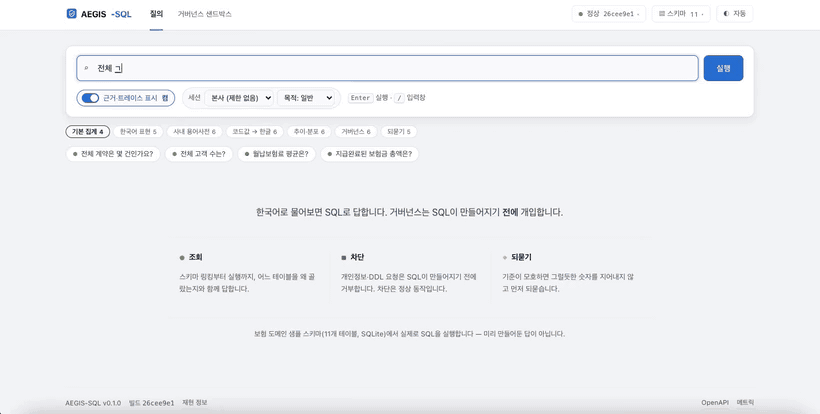

<sub><b>14초 데모</b> — ① 한국어 질문 → SQL 실행 (template 티어 · 11ms · $0)<br/>
② 주민등록번호 요청은 <b>SQL이 만들어지기 전에</b> 차단 (PII_REQUEST)
③ 모호한 질문은 추측하지 않고 되물음</sub>

</div>

---

## 이 프로젝트가 푸는 문제

국내 금융·보험사의 코어 DB는 이렇게 생겼습니다.

```sql
CREATE TABLE TB_CTRT (              -- 계약
    CTRT_NO      TEXT PRIMARY KEY,  -- 계약번호
    CTRT_DT      TEXT NOT NULL,     -- 계약체결일자   ← DATE 아님. 'YYYYMMDD' 문자열
    CTRT_STAT_CD TEXT NOT NULL,     -- 계약상태코드   ← '02' 가 무슨 뜻인지 스키마에 없음
    MON_PRM      INTEGER NOT NULL,  -- 월납보험료
    CHNL_CD      TEXT NOT NULL      -- 모집채널코드
);
CREATE TABLE TB_CUST (              -- 고객
    RRNO_ENC     TEXT,              -- 주민등록번호암호화  ← 절대 반출되면 안 되는 컬럼
    TELNO        TEXT,              -- 휴대전화번호
    ...
);
```

사용자는 이렇게 묻습니다.

> "작년 하반기에 체결된 계약 중 월납보험료가 20만원 이상인 건수를 지점별로 알려줘"

**LLM에 스키마를 통째로 던지는 방식은 여기서 무너집니다.**

| 무너지는 지점 | 실제로 벌어지는 일 |
|---|---|
| 물리명이 암호 같음 | `CTRT_STAT_CD` 와 "유지율" 사이에 임베딩 유사도가 없음 |
| 날짜가 문자열 | 모델이 `DATE(CTRT_DT) > '2025-07-01'` 을 생성 → 항상 0건 |
| 코드값이 스키마 밖 | `WHERE CTRT_STAT_CD = '실효'` → 항상 0건 |
| 조인 경로가 멀다 | 계약↔지점은 `TB_AGNT` 를 경유해야 하는데 카티션 곱 생성 |
| 스키마가 크다 | 테이블 수백 개를 다 넣으면 토큰이 폭발하고 정확도도 떨어짐 |
| **PII가 운영 테이블에 있음** | 프롬프트로 "조회하지 마세요"라고 부탁하는 것은 통제가 아님 |

AEGIS-SQL은 이 여섯 가지를 **각각 다른 층에서** 해결합니다.

---

## 다른 Text-to-SQL 프로젝트와 갈라지는 지점

| | 흔한 구현 | AEGIS-SQL |
|---|---|---|
| **도메인 지식** | 스키마만 프롬프트에 투입 | 사내 용어사전 41종(별칭 151개, SQL 조각 32개)을 **스키마 링킹 단계에서 주입** |
| **검색** | 임베딩 top-k | dense + **직접 구현한 BM25** + 용어사전 + **프로파일된 실제 값·코드명** 하이브리드 |
| **모델 선택** | 항상 최상위 모델 | **TensorFlow로 학습한 난이도 라우터**가 티어 선택 → **numpy 가중치로 export해 서빙**(런타임에 TF 없음) |
| **소형 모델** | `peft` + HF 체크포인트 | **PyTorch로 직접 구현한 Transformer + LoRA + SFT + DPO** (RoPE/RMSNorm/SwiGLU/KV캐시, 다운로드 0) |
| **학습 데이터** | 공개 데이터셋 | **스키마만으로 생성**: SQL 샘플링 → 한국어 역번역 → 증강 → 실행 검증 → 누수 없는 분할 |
| **오류 처리** | LLM에 재요청 | **규칙 기반 수리 8종을 먼저**, 실패 시에만 LLM. 게다가 **"실행은 되지만 확실히 틀린"** SQL(YYYYMMDD 컬럼 vs `'2025-07-01'`)도 정적 검사로 잡아 교정 — 오류가 안 났다고 정답인 것은 아니므로 |
| **보안 (문장)** | 프롬프트에 "PII 금지" | **sqlglot AST에서 강제**: 별칭·CTE·서브쿼리·`SELECT *` 확장까지 추적해 차단/마스킹/행정책 주입 |
| **보안 (요청)** | 해당 없음 | "테이블 지워줘"에 조용히 SELECT를 돌려주지 않고 **요청 자체를 거부**. 변경 요청 10/10 차단, 조회 질문 오탐 0/17 (테스트로 강제) |
| **평가** | 예시 몇 개 | **KorFin-Bench 106문항** + 어블레이션 + **거버넌스 10 / 모호성 6 프로브를 점수에 포함** |
| **프롬프트** | 코드에 하드코딩 | 버전·해시 관리 레지스트리 + **실행 정확도로 채점하는 자동 최적화 탐색** |
| **논문** | 언급 없음 | [`docs/PAPERS.md`](docs/PAPERS.md) — 34편을 **적용/변형/기각**으로 분류하고 각각 모듈에 매핑 |

---

## 30초 만에 확인하기

```bash
git clone https://github.com/sokldjs554/aegis-sql && cd aegis-sql
make setup          # 가상환경 + 의존성 + 데모DB(37만행) + 벤치마크 + 프로파일
make demo           # 대표 질의 5개 (거버넌스 차단·되묻기 사례 포함)
```

<p align="center">
  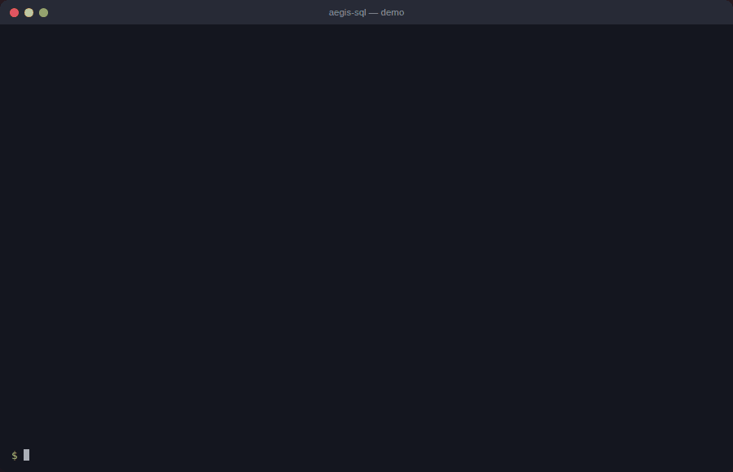
</p>

**API 키가 없어도 전부 동작합니다.** LLM 티어가 없으면 결정론 template 티어로
자동 폴백합니다(자체 학습 sLLM 티어는 승격 규칙에 따라 옵트인 — `--tier slm`).
이것이 CI에서도 전체 파이프라인이 도는 이유입니다.

```bash
make ask Q="실효된 계약의 채널별 비중은?"     # 임의 질문
aegis ask "..." --explain                      # 링킹 근거 + 라우팅 사유 + 스팬 트레이스
make serve                                     # http://localhost:8000 웹 콘솔 + /docs
make eval                                      # 재현 가능한 평가 리포트
```

### 컨테이너로 띄우기

```bash
docker build -t aegis-sql . && docker run --rm -p 8000:8000 aegis-sql
```

이미지는 학습 스택(PyTorch·TensorFlow)을 담지 않습니다 — 서빙 경로는 numpy 추론만
쓰므로 약 4GB를 덜어냅니다. 데모 DB·스키마 프로파일·라우터 가중치는 빌드 시점에
구워지므로 컨테이너는 첫 요청 전에 아무것도 내려받지 않습니다.

포트는 `PORT` 환경변수로 받고(기본 8000), 컨테이너는 비루트(uid 1000)로 돕니다 —
호스팅 플랫폼 대부분이 요구하는 조건이라 CI도 `--user 1000:1000`으로 스모크합니다.
공개 URL에 올릴 때는 `AEGIS_DEMO_PUBLIC=1`을 주면 `/v1/feedback`이 디스크에 쓰지
않습니다. 배포 절차는 두 갈래입니다 — 카드 없이 공개 URL 을 만들려면
[`deploy/render.md`](deploy/render.md)(느리지만 청구가 구조적으로 불가능),
빠른 응답이 필요하면 [`deploy/cloudrun.md`](deploy/cloudrun.md)(월 몇 센트).

### 실제 화면 — 웹 콘솔 (`make serve`)

맨 위 데모 GIF가 이 콘솔을 실제로 조작한 화면입니다. 아래는 정지 캡처입니다.

<p align="center">
  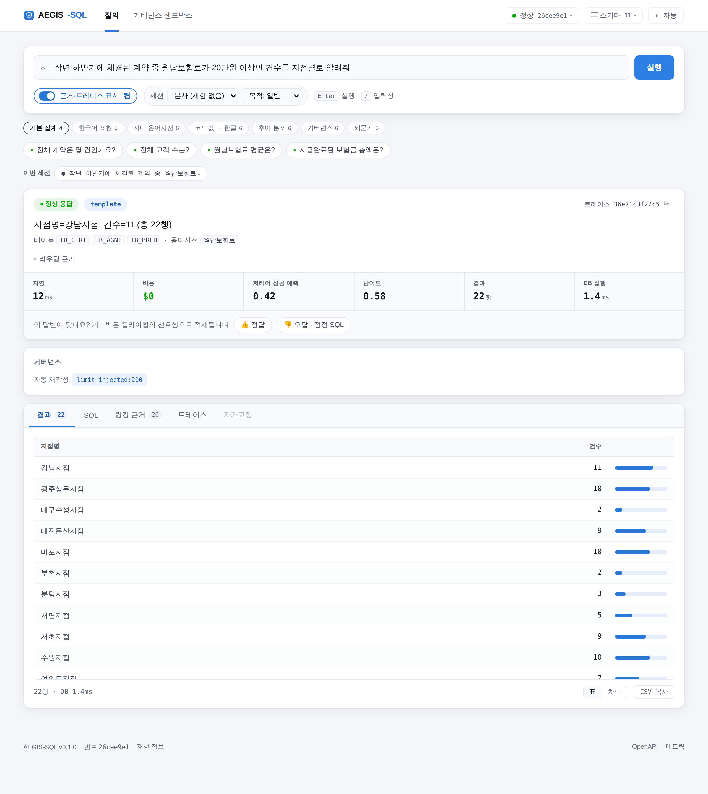
</p>
<p align="center">
  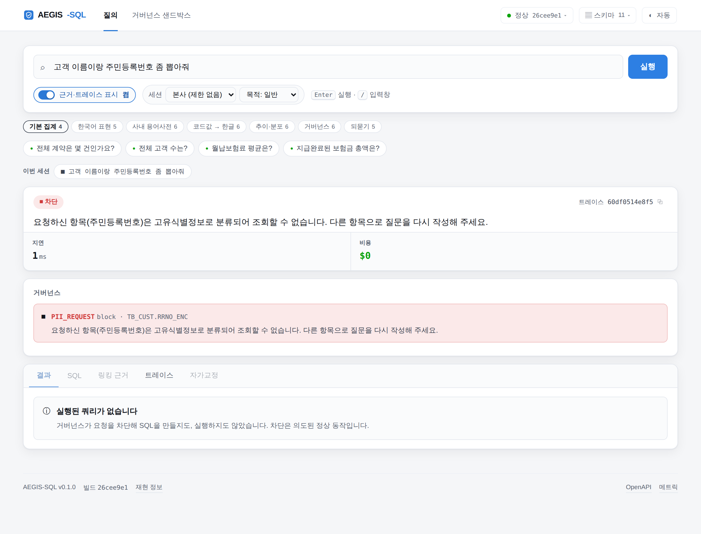
</p>

콘솔은 **답을 보여주는 화면이 아니라 답의 근거를 보여주는 화면**입니다.

- **파이프라인 스테퍼** — 정규화 → 의도 가드 → 링킹 → 라우팅 → 생성 → AST 가드 → 실행이
  스트리밍으로 진행되며, 차단·되물음이 발생한 단계에서 멈춘 것이 그대로 보입니다.
- **탭 5종** — 결과 / SQL / **링킹 근거**(점수 막대·출처) / **트레이스**(스팬별 간트) / 자가교정.
- **비어 있는 탭이 이유를 말합니다.** 차단이면 "거버넌스가 요청을 차단해 SQL을 만들지도,
  실행하지도 않았습니다", 되묻기면 "추측해서 그럴듯한 숫자를 만드는 대신 기준을 먼저
  확인합니다" — 같은 빈 탭이라도 **상태마다 다른 문장**이 본문에 뜹니다.
  탭을 죽은 컨트롤로 두지 않으려고 `disabled` 대신 흐리게만 표시하고, 눌러서 읽을 수
  있게 했습니다(보조기술에서도 조작 가능).
- **핵심 지표** — 지연·비용·**저티어 성공 예측**·난이도·행수·DB 실행시간을 한 줄로.
  라우터 신뢰도는 "답이 맞을 확률"이 아니라 "값싼 티어가 이 질문을 맞힐 확률"이므로
  라벨도 그렇게 씁니다.
- 결과 표의 숫자 열에는 크기 막대가 붙고, CSV·SQL·trace id를 그 자리에서 복사할 수
  있습니다(CSV 는 RFC 4180 로 이스케이프합니다 — 지점명에 쉼표가 들어가도 열이 밀리지 않습니다).
- **표 ↔ 그래프** — 집계 결과는 버튼 하나로 축·눈금이 있는 SVG 그래프가 됩니다.
  카테고리 12개 이하는 세로 막대, 그보다 많으면 가로 막대, `YYYYMM` 라벨이면 추이선으로
  그립니다. 축 최대값은 1·2·5×10ᵏ 으로 올려 눈금이 읽히는 수가 되게 했고, 추이선의
  y축은 0이 아니라 **데이터 범위**에 맞춥니다(83~114 같은 구간이 평평해 보이지 않게).
- **마스킹된 컬럼에는 🔒 배지가 붙습니다.** 정책이 재작성한 컬럼(`mask:TB_CUST.CUST_NM`)과
  결과 표의 열을 이름으로 맞춰 표시하므로, 값이 `황**` 인 이유가 화면에서 바로 보입니다.
- 라이트/다크/자동 테마, 모바일 폭까지 대응합니다. 한글 입력 조합 중 Enter 가
  질의를 쏘지 않도록 IME 조합 상태를 확인합니다.

<p align="center">
  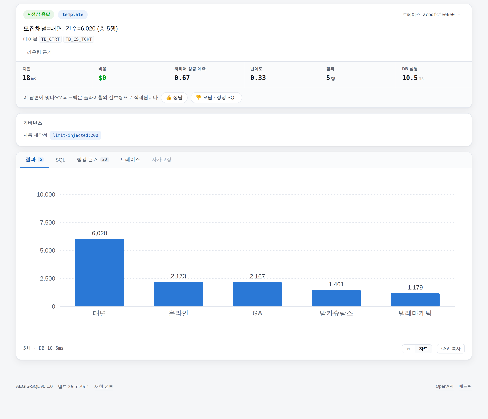
</p>
<p align="center">
  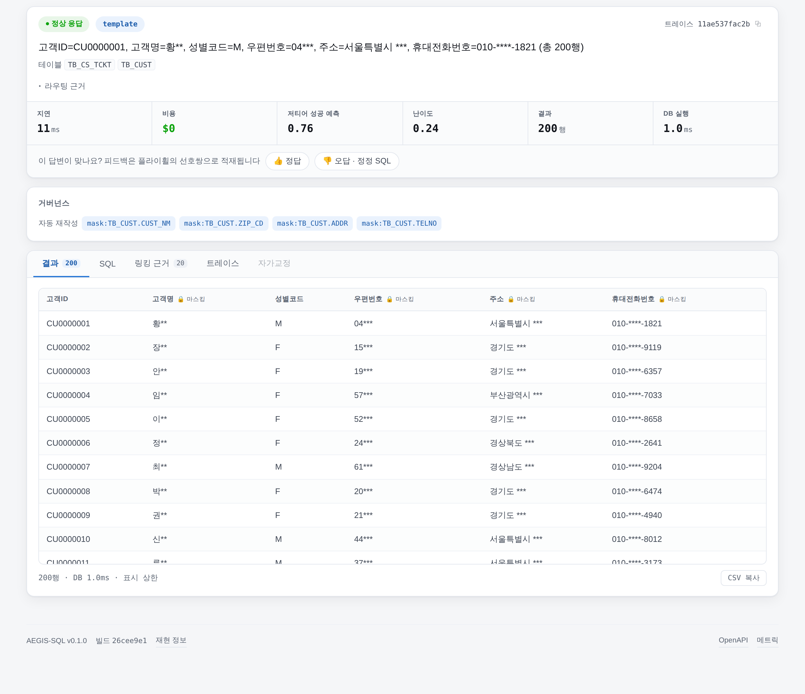
</p>

#### 재현 정보는 페이지의 각주가 아니라 그 응답의 속성입니다

각 응답의 **트레이스 탭 맨 위**에 그 답이 어떤 조건에서 나왔는지가 함께 기록됩니다 —
스키마 지문 · 프롬프트 버전 · **실제 생성 티어** · **그때의 세션 컨텍스트** · trace id.
질의 후 상단 드롭다운을 바꿔도 이 기록은 변하지 않습니다(요청 시점에 고정).

> 같은 질문에 같은 답이 나오는지는 **스키마 지문 · 프롬프트 버전 · 생성 티어**
> 세 값이 같은지로 판정합니다.

우상단 `● 정상 26cee9e1` 은 엔진 상태와 스키마 지문 앞 8자입니다. 누르면
**엔진 정보 → 런타임·재현** 탭이 열려 전체 지문·프롬프트 레지스트리·프로바이더
가용성·라우터 적재 여부를 값 전체로 확인하고 복사할 수 있습니다.

<p align="center">
  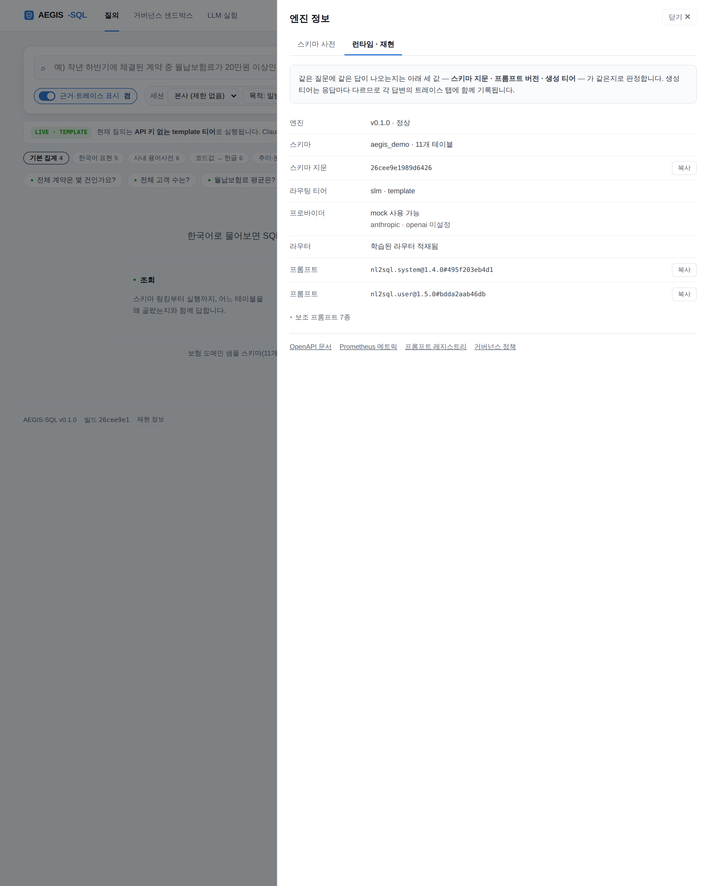
</p>

차단 화면의 트레이스는 `intent_guard refused=true`에서 끝납니다 —
**SQL이 생성되지 않았다는 사실 자체가 트레이스로 증명됩니다.**

#### 세션 컨텍스트 — 행 수준 정책을 직접 켜 봅니다

상단의 `세션`·`목적` 선택이 그대로 `ctx`로 실려 나가고, 정책이 조건에 맞는 필터를
SQL에 주입합니다. 같은 질문이라도 **누가 어떤 목적으로 묻느냐에 따라 실행되는 SQL이
달라지는 것**을 한 화면에서 보여줍니다.

| 세션 컨텍스트 | 적용 정책 | SQL 에 주입되는 것 |
|---|---|---|
| `branch_cd=BR003` | `BRANCH_SCOPE` | `WHERE TB_AGNT.BRCH_CD = 'BR003'` |
| `purpose=marketing` | `MKT_CONSENT` | `WHERE TB_CUST.MKT_AGR_YN = 'Y'` (개인정보보호법 제22조) |

<p align="center">
  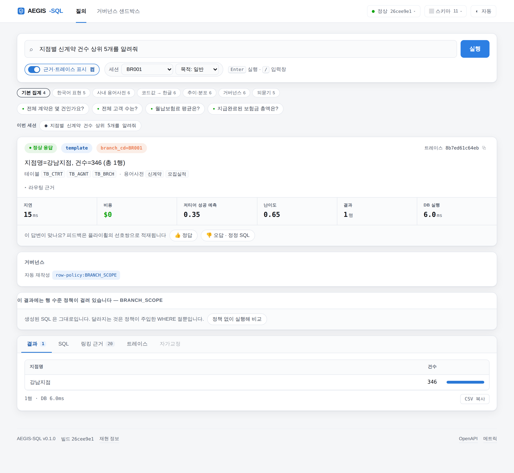
</p>

행 정책이 걸린 응답에는 **정책 없이 실행해 비교** 버튼이 붙습니다. 누르면 같은
질문을 정책 없이 한 번 더 실행해 **행 수 · 주입된 WHERE 절 · 상위 3행**을 나란히
보여줍니다. 정책이 "걸려 있다"는 주장이 아니라 **무엇이 사라졌는지**를 보여주는
화면입니다 — 아래는 같은 질문이 `BR001` 세션에서 5행 → 1행으로 줄어드는 장면입니다.

<p align="center">
  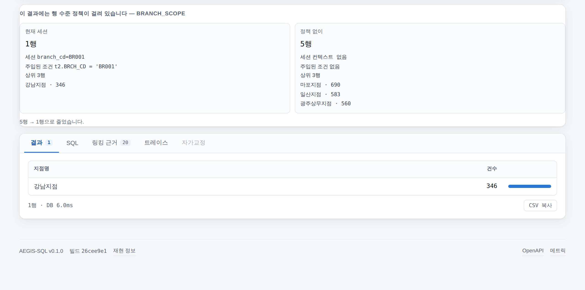
</p>

선택지는 화면이 하드코딩하지 않습니다. [`/v1/policy`](src/aegis_sql/api/app.py)가
정책 문서를 읽어 **어떤 컨텍스트 키가 있고 어떤 값을 고를 수 있는지 스스로 선언**하고,
콘솔은 그것을 채웁니다 — `configs/policy/*.yaml`을 고치면 UI가 따라옵니다.
값을 열거해 주는 대상은 **공개 등급 컬럼뿐**입니다. 정책을 설명하는 API가 정작 그
정책이 가린 값의 우회 통로가 되면 안 되기 때문입니다(회귀 테스트로 고정).

#### 거버넌스 샌드박스 — 임의 SQL을 실행하지 않고 판정

우리가 만든 SQL만 검사받는다면 가드는 신뢰의 근거가 못 됩니다. 샌드박스 탭에 아무
SQL이나 붙여 넣으면 **실행 없이 정책 판정만** 돌려줍니다 — 위반 코드·사유·자동 재작성
(마스킹·LIMIT·행 정책)까지 그대로.

<p align="center">
  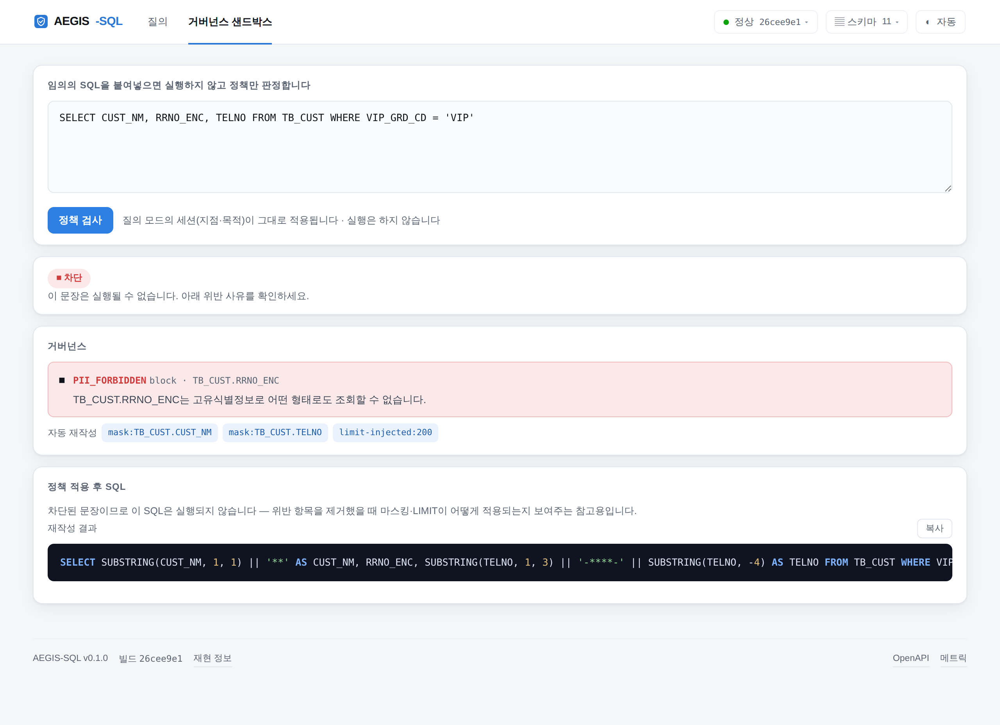
</p>

#### 스키마 사전 — 무엇이 어떤 등급인지

`▤ 스키마 11` 버튼으로 11개 테이블·101개 컬럼을 등급(공개 87 / 내부 5 / 마스킹 8 /
반출 금지 1)과 함께 펼쳐 봅니다. 프롬프트에 실제로 실리는 스키마 카드의 토큰 수도
같이 표시됩니다.

(추가 캡처: [첫 화면](docs/images/console-empty.png) ·
[거버넌스 차단](docs/images/console-governance.png) ·
[되묻기](docs/images/console-clarify.png) · [트레이스](docs/images/console-trace.png) ·
[스키마 사전](docs/images/console-schema.png) · [다크 모드](docs/images/console-query-dark.png))

<sub>이 문서의 화면 캡처와 GIF 는 전부 현재 커밋의 코드를 실제로 띄워 자동으로
찍은 것입니다 — 손으로 그리거나 합성하지 않았습니다. 다시 찍는 스크립트도 함께
둡니다(<a href="scripts/docs/README.md"><code>scripts/docs/</code></a>). 캡처는 코드보다
먼저 낡기 때문입니다.</sub>

### 실제 출력 — CLI

아래는 `make demo` / `aegis ask` 의 **실제 캡처**입니다 (API 키 없음, template 티어).

```
$ aegis ask "작년 하반기에 체결된 계약 중 월납보험료가 20만원 이상인 건수를 지점별로 알려줘"

● ok  tier=template  conf=0.42  14ms  $0.000000  trace=2bc8bc895b1f

SELECT t3.BRCH_NM AS "지점명", COUNT(*) AS "건수"
FROM TB_CTRT AS t1
JOIN TB_AGNT AS t2 ON t1.AGNT_ID = t2.AGNT_ID
JOIN TB_BRCH AS t3 ON t2.BRCH_CD = t3.BRCH_CD
WHERE t1.CTRT_DT BETWEEN '20250701' AND '20251231' AND t1.MON_PRM >= 200000
GROUP BY t3.BRCH_NM
LIMIT 200                      ← 거버넌스 가드가 주입 (재작성: limit-injected:200)

지점명        건수
강남지점      11
광주상무지점  10
대구수성지점  2
대전둔산지점  9
…  총 22행
```

`작년 하반기` → `20250701~20251231`, `20만원` → `200000`, 지점에 닿기 위한 `TB_AGNT` 경유가
**LLM 호출 한 번 없이** 결정되었습니다. 14ms, 0원.

```
$ aegis ask "고객 이름이랑 주민등록번호 좀 뽑아줘"

● blocked  tier=-  conf=-  0ms  $0.000000  trace=62c507e9308c
╭──────────────────────── 거버넌스 차단 ────────────────────────╮
│ BLOCK PII_REQUEST [TB_CUST.RRNO_ENC]: 요청하신 항목(주민등록번호)은
│ 고유식별정보로 분류되어 조회할 수 없습니다. 다른 항목으로 질문을
│ 다시 작성해 주세요.
╰───────────────────────────────────────────────────────────────╯
```

주민번호를 빼고 이름만 돌려주는 것은 **조용한 대체**이지 거부가 아닙니다.
그래서 SQL을 만들기 전에 **요청 자체를 거부**합니다. (`DELETE 해줘` 도 같은 경로로 거부됩니다.)

```
$ aegis ask "설계사 실적 좀 보여줘"

● clarify  tier=-  conf=-  2ms  $0.000000  trace=2312d0b2b879
╭──────────────────────────── 되묻기 ───────────────────────────╮
│ '실적'을 어떤 기준으로 계산할까요?
╰────────── 계약 건수 / 월납보험료 합계 / 총가입금액 합계 ──────╯
```

추측해서 그럴듯한 SQL을 만드는 대신 되묻습니다.
`"모집 실적"`처럼 **용어사전에 정의된 표현**은 되묻지 않고 바로 답합니다.

---

## 아키텍처

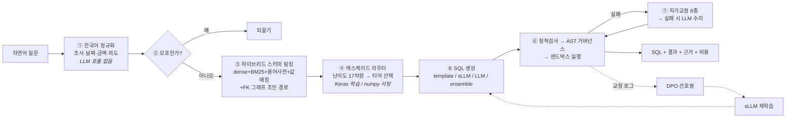

자세한 내용: [`docs/ARCHITECTURE.md`](docs/ARCHITECTURE.md)

### 설계 원칙 4가지

1. **LLM은 마지막에 부른다.** 정규화·링킹·난이도 판정·예시 선택·대부분의 오류 수리는 결정론으로 푼다.
   SQL 생성을 위한 LLM 호출은 질의당 **1회**다 — 확신이 낮을 때만 ensemble 티어가 5샘플을 뽑고,
   답변 문장 합성에 보조 호출 1회가 더 붙는다(아래 비용 정정 참고).
2. **모델 출력은 신뢰할 수 없는 입력이다.** 생성된 SQL은 사용자가 붙여넣은 문자열과 같은 신뢰도를 갖는다. 검증은 프롬프트가 아니라 **파싱된 AST**에서 한다.
3. **학습과 서빙을 분리한다.** 라우터는 Keras로 학습하고 numpy 가중치로 export한다. 런타임 이미지에 TensorFlow도 PyTorch도 들어가지 않는다.
4. **재현되지 않는 숫자는 측정이 아니다.** 데이터·플라이휠·학습·평가 전부 시드 고정. 리포트에는 프롬프트 해시와 스키마 지문이 박힌다.

---

<!-- RESULTS:BEGIN -->
## 측정 결과

> 전부 `make setup && make eval` 로 재현됩니다. 표는 리포트 산출물을 옮긴 것이고, 리포트
> 하단에는 사용된 **프롬프트 해시·스키마 지문·활성 티어**가 함께 기록됩니다.
> template 열은 **API 키 없이** 측정(`reports/eval.md`), LLM 열은 **claude-sonnet-5 실측**
> (`reports/eval_llm_only.md` 단독 / `reports/eval_llm.md` 캐스케이드)입니다.

### 요약 — KorFin-Bench 106문항, 티어 구성별

| 지표 | template 단독 | 캐스케이드 (라우터) | LLM 단독 |
|---|---:|---:|---:|
| **실행 정확도 (EX)** | 44.4% | **52.2%** | **57.8%** |
| — easy (30) | 90.0% | 96.7% | **100.0%** |
| — medium (40) | 32.5% | 35.0% | 40.0% |
| — hard (20) | 0.0% | 20.0% | **30.0%** |
| 실행 성공률 | **100.0%** | **100.0%** | 95.6% |
| VES (BIRD) | 0.357 | 0.409 | 0.420 |
| p50 / p95 지연 | **6 ms / 21 ms** | 4.5 s / 39.2 s | 5.8 s / 10.3 s |
| 질의당 비용 | **$0** | $0.0279 | $0.0127 |
| 티어 분포 (ok 90) | template 90 | template 54 · ensemble 36 | llm 90 |
| **거버넌스 (10) / 모호성 (6)** | 100% / 100% | 100% / 100% | 100% / 100% |

LLM 열의 모델은 `claude-sonnet-5`. 실측 총비용은 단독 약 $1.1, 캐스케이드 약 $2.5.

> **비용 수치에 대한 정정** — 위 표의 질의당 비용은 SQL 생성 호출만 계상된 값입니다.
> 답변 문장을 만드는 보조 LLM 호출은 생성기 내부(`aux_cost_usd`)에만 쌓이고 질의 비용에
> 합산되지 않아, 12초짜리 답변 합성이 화면에 `$0.000000`으로 표시되는 것을 실사용 중
> 발견했습니다. 현재 코드는 보조 호출까지 합산하며(회귀 테스트로 고정), 따라서 **실제
> 지출은 위 표보다 큽니다.** 아카이브된 리포트는 수정 이전 측정치라 그대로 두고 이렇게
> 밝혀 둡니다.

**hard 티어는 실측이 설계를 증명합니다.** 문법 기반 template은 hard 0% —
상관 서브쿼리·2단 CTE는 구조적으로 도달할 수 없는 형태 — 지만, LLM 티어를 켜면
**hard 30%(단독) / 20%(캐스케이드)**로 올라갑니다. "상위 티어가 hard를 담당한다"는
캐스케이드 설계 가설이 수치로 확인되었습니다.

**그리고 숨기지 않는 발견 하나**: 캐스케이드(52.2%)는 LLM 단독(57.8%)에 **5.6%p 뒤집니다**
— 90문항 중 5문항. 처음에는 5-샘플 ensemble을 원인으로 적었는데, 문항 단위로 다시 집계하니
**범인은 ensemble이 아니라 라우터의 에스컬레이션 임계값**이었습니다.

| 라우터의 결정 | 문항 | 캐스케이드가 맞힌 수 | 같은 문항을 LLM 단독이 맞힌 수 | 차 |
|---|---:|---:|---:|---:|
| template 에 남김 | 54 | 27 (50.0%) | 33 (61.1%) | **−6** |
| ensemble 로 승격 | 36 | 20 (55.6%) | 19 (52.8%) | **+1** |

ensemble이 실제로 맡은 36문항에서는 오히려 **앞섰습니다**(hard 33.3% vs 25.0%). 잃은 것은
라우터가 template 에 남겨 둔 54문항 쪽입니다 — LLM이라면 맞혔을 10문항을 놓치고 4문항을
되찾아 순손실 6. 표의 `medium 35.0 vs 40.0` 같은 난이도별 수치는 **티어 구성이 다른 두 실행의
전체 벤치마크 값**이라 ensemble의 성능으로 읽으면 안 됩니다. 그래서 다음 단계는
"ensemble을 단일 호출로 바꾸는 것"이 아니라 **에스컬레이션 임계값(`escalate_threshold` 0.55)을 내려
template 구간을 줄이는 것**입니다. 다만 ensemble은 호출 수 5배 → 질의당 비용 2.2배라, 얻은 +1문항이
그 값을 하는지는 별도 문제입니다.

### 어블레이션 — 무엇이 실제로 값을 하는가

한 번에 **한 구성요소만** 제거하고 같은 벤치마크를 다시 돌린 결과입니다.

| 구성 | EX | Δ | medium |
|---|---:|---:|---:|
| `full` (기준선) | 44.4% | — | 32.5% |
| `no-glossary` — 사내 용어사전 제거 | 34.4% | **−10.0%p** | 20.0% |
| `dense-only` — BM25 제거 | 41.1% | −3.3%p | 27.5% |
| `no-schema-linking` — 전체 스키마 투입 | 43.3% | −1.1%p | 30.0% |
| `no-value-link` / `lexical-only` / `no-fk-expand` / `no-repair` | 44.4% | ±0.0%p | 32.5% |
| `no-fewshot` / `card-compact` | 44.4% | n/a | 32.5% |

**41개짜리 사내 용어사전이 10%p를 만듭니다.** 이 도메인에서 정확도를 가르는 것은
모델 크기가 아니라 도메인 지식이 검색 단계에 주입되는지 여부라는 이 프로젝트의 전제를,
스스로의 어블레이션이 지지합니다.

`n/a` 는 **구조적으로 영향을 줄 수 없는** 변형입니다 — template 티어는 프롬프트를 읽지 않으므로
few-shot/카드 형식 변경이 결과를 바꿀 수 없습니다. Δ 0.0%p 항목들도 마찬가지로
"이 티어에서는" 기여가 관측되지 않았다는 뜻이며, 상위 티어에서 다시 재야 합니다.
리포트는 이 구분을 표에 명시합니다.

### 캐스케이드 라우터 — 학습은 Keras, 서빙은 numpy

라벨은 합성이 아니라 **관측값**입니다: 평가를 돌려 "값싼 티어가 이 질문을 틀렸는가"를
기록하고(1,301건), 그것으로 학습합니다.

| 지표 | 값 |
|---|---:|
| AUC (val / holdout) | 0.970 / **0.937** |
| ECE (보정 전 → 후) | 0.099 → **0.044** |
| 파라미터 | 3,299 |
| **Keras ↔ numpy 추론 오차** | **5.96e-08** |

| 임계값 | 에스컬레이션 | 비용 절감 | 정확도 유지 | hard recall |
|---:|---:|---:|---:|---:|
| 0.30 | 80.4% | 19.6% | 95.0% | 93.2% |
| 0.50 | 71.5% | 28.5% | 93.5% | 91.1% |
| 0.70 | 64.2% | 35.8% | 89.2% | 85.3% |

실제 라우팅 예시 (학습된 라우터, 저장소에 포함된 15KB 가중치):

```
"전체 계약은 몇 건인가요?"                       P(hard)=0.26  → template
"채널별 계약 건수를 많은 순으로 보여줘"            P(hard)=0.33  → template
"각 지점에서 모집 실적 1위인 설계사를 알려줘"       P(hard)=0.999 → 상위 티어
"최근 1년 청구 건수가 직전 1년보다 늘어난 유형은?"   P(hard)=0.95  → 상위 티어
```

아래 두 개는 template 티어가 실제로 틀리는 질의입니다. 라우터가 그것을 맞혔습니다.

> **한계도 적어 둡니다.** 이 라우터는 플라이휠 test 분할(template 티어 실패율 75%)로 학습됐고,
> 큐레이션된 KorFin-Bench에서는 실패율이 56%입니다. 분포가 다르므로 라우터는 다소 **비관적**으로
> 기울어 있습니다. 재학습은 `aegis eval --routing-log ...` 로 원하는 분포에서 라벨을 다시 모으면
> 되고, **라벨이 관측값이라는 점이 이 설계의 핵심**이라 재학습이 명령 두 줄로 끝납니다.

### 데이터 플라이휠 — 스키마만으로 12,540쌍

```
스키마 11테이블 → SQL 프로그램 4,000개 (22 템플릿) → 한국어 역번역 → 증강 ×3
  → 16,000쌍 → 실행 검증 −460 → 퇴화 제거 −916 → 중복 제거 −1,585 → 난이도 균형 −499
  → 12,540쌍  (train 9,998 / dev 1,212 / test 1,330)
```

| 항목 | 값 |
|---|---|
| **train↔test 스켈레톤 누수** | **0건** (클러스터 단위 분할) |
| 난이도 교차검증 일치도 | 0.835 (독립 분류기와 대조) |
| 소요 시간 | 138초 (CPU) |
| 재현성 | 시드 고정 — 같은 시드면 같은 코퍼스 |

### 자체 구현 sLLM (PyTorch, 다운로드 0)

플라이휠 코퍼스로 **CPU에서 처음부터** 학습합니다.

| 단계 | 결과 (5.3M 파라미터, CPU 4코어, 61분) |
|---|---|
| 바이트 BPE (코퍼스에서 직접 학습) | vocab 4,368, 한글·SQL **무손실 왕복** |
| SFT (프롬프트 마스킹, 846스텝) | dev token acc 0.648 → **0.690**, dev loss 최저 2.487 |
| **DPO** (선호쌍 자동 생성, 사람 라벨 **0건**) | reward margin **1.53 → 5.27**, acc **0.99** |
| LoRA | `B=0` 초기화로 적용 직후 출력 동일(`allclose`, atol 1e-6), 학습 파라미터 < 5% — 둘 다 테스트로 강제 |

### 그리고 이 모델이 실제로 얼마나 하는지 — 숨기지 않습니다

| 티어 | EX | 실행 성공률 | p50 | 결과 |
|---|---:|---:|---:|---|
| `template` | **44.4%** | 100.0% | 6 ms | ok 90 |
| `slm` (5.3M) | **0.0%** | 5.6% | 290 ms | **차단 80** / 실패 5 / ok 5 |
| `llm` (claude-sonnet-5) | **57.8%** | 95.6% | 5.8 s | hard **30%** — template 0%의 영역을 실측으로 채움 |
| 캐스케이드 (template+ensemble) | **52.2%** | 100.0% | 4.5 s | LLM 단독에 −5.6%p — 원인은 ensemble이 아니라 **라우터 임계값**(위 참조) |

5.3M 파라미터를 9,000쌍으로 1시간 학습하면 SQL의 토큰 통계는 배우지만
유효한 SQL을 안정적으로 만들지 못합니다. 그래서 여기서 확인된 것은 세 가지입니다.

1. **가드가 100% 막았습니다** — 80건 차단, **유효하지 않은 문장이 DB에 도달한 사례 0건**.
   생성기가 무너져도 시스템은 안전하게 degrade합니다.
2. **캐스케이드 승격 규칙을 데이터로 정했습니다** — sLLM을 캐스케이드에 넣자 easy가
   90% → 16.7%로 무너져서, **"한 티어는 벤치마크에서 아래층을 이긴 뒤에만 편입된다"**를
   규칙으로 못박고 기본 비활성(`router.enable_slm: false`)으로 두었습니다.
3. **측정값이 거짓말하지 않게 했습니다** — 개발 중 체크포인트 경로가 어긋나
   `tier=slm`으로 보고되면서 실제로는 template이 답한 적이 있었고, 지금은
   티어 폴백이 라우팅 사유와 트레이스에 반드시 남습니다.

증명하려는 것은 정확도가 아니라 **토크나이저·트랜스포머·LoRA·SFT·DPO를 직접 구현했고
학습이 실제로 수렴하며, 실패했을 때 시스템이 그것을 안전하게 처리한다**는 사실입니다.
스케일업 시 바뀌는 것은 `AegisLMConfig` 의 숫자와 하드웨어뿐입니다.
자세한 내용: [`docs/SLM.md`](docs/SLM.md)

### 코드 규모

| | |
|---|---|
| Python | 26,005줄 (src 21,912 / tests 2,382 / scripts 1,711) |
| 테스트 | **265개 통과** (실제 DB 대상, 목킹 없음) · `ruff` + `mypy` 클린 |
| 문서 | 7편 (아키텍처 · 논문매핑 · 거버넌스 · 플라이휠 · sLLM · 평가 · 프롬프트) |
| 벤치마크 | 106문항 (gold SQL 90개 전부 실행 검증) |
<!-- RESULTS:END -->

---

## 공고 요구 기술과 구현 위치

| 요구 사항 | 어디에, 어떻게 |
|---|---|
| **Python** | 약 26,000줄, 전 함수 타입힌트, `ruff` + `mypy` 클린, pytest 265개 |
| **PyTorch** | [`training/`](src/aegis_sql/training/) — 디코더 트랜스포머(RMSNorm·RoPE·SwiGLU·KV캐시), LoRA, SFT, DPO **전부 직접 구현** |
| **TensorFlow** | [`router/tf_router.py`](src/aegis_sql/router/tf_router.py) — Keras 난이도 분류기 학습 → **numpy 가중치 export**(서빙 경로에 TF 없음) + temperature scaling 보정 |
| **LangChain** | [`generation/llm_generator.py`](src/aegis_sql/generation/llm_generator.py) — LCEL 체인, Anthropic/OpenAI 프로바이더 추상화, 토큰·비용 회계 |
| **FastAPI** | [`api/`](src/aegis_sql/api/) — `/v1/query`, **SSE 스트리밍**, `/v1/link`, `/v1/policy`, `/v1/policy/check`, `/v1/schema`, `/v1/feedback`, `/metrics`, 단일 파일 웹 콘솔 |
| **VectorDB** | [`retrieval/vectorstore.py`](src/aegis_sql/retrieval/vectorstore.py) — Chroma / FAISS / 무의존 numpy 스토어를 **동일 인터페이스**로 |
| **RAG 파이프라인** | [`retrieval/schema_linker.py`](src/aegis_sql/retrieval/schema_linker.py) — 하이브리드 검색 + FK 그래프 확장 + 근거(evidence) 기록 |
| **Prompt Engineering** | [`prompts/`](src/aegis_sql/prompts/) — 버전·해시 레지스트리 + **실행 정확도로 채점하는 자동 최적화**. 방법론: [`docs/PROMPT_ENGINEERING.md`](docs/PROMPT_ENGINEERING.md) |
| **sLLM 연구/개발** | [`docs/SLM.md`](docs/SLM.md) — 왜 직접 구현했는지, LoRA `B=0` 보증, DPO 선호쌍 자동 생성 |
| **데이터 증강 / 구축** | [`docs/FLYWHEEL.md`](docs/FLYWHEEL.md) — 스키마 → SQL 샘플링 → 역번역 → 한국어 증강 → 실행검증 → 누수 없는 분할 |
| **AI 모델 설계** | AegisLM 아키텍처 + 라우터 특징 설계 + 보정(calibration) |
| **NLP 논문 조사** | [`docs/PAPERS.md`](docs/PAPERS.md) — 34편을 **적용/변형/기각** 3분류로 모듈에 매핑, 기각 사유까지 명시 |
| **git 협업** | 의미 단위 커밋, CI 6잡(3 Python 버전 × lint/test/e2e + ML 스택 + 낡은 의존성 재현 + Docker) |

---

## 저장소 구조

```
aegis-sql/
├── src/aegis_sql/
│   ├── types.py            도메인 모델 — 모든 모듈의 공통 언어
│   ├── pipeline.py         오케스트레이터 (단계 순서가 사는 유일한 곳)
│   ├── schema/             인트로스펙션 · FK 조인 그래프 · 값 프로파일링 · 프롬프트 카드
│   ├── nlu/                한국어 정규화 · 모호성 탐지 · 질의 분해
│   ├── retrieval/          임베더 · 벡터스토어 · 용어사전 · 스키마 링킹 · few-shot
│   ├── generation/         template / sLLM / LLM 3티어 + SQL 스켈레톤
│   ├── verify/             AST 거버넌스 · 정적검사 · 샌드박스 실행 · 자가교정 · 투표
│   ├── router/             난이도 특징 · Keras 라우터 · 보정 · 캐스케이드
│   ├── flywheel/           SQL 샘플러 · 역번역 · 증강 · 품질필터 · 데이터셋 빌드
│   ├── training/           BPE · Transformer · LoRA · SFT · DPO · 추론
│   ├── prompts/            버전 레지스트리 · 자동 최적화
│   ├── eval/               지표 · 하네스 · 리포트
│   ├── api/                FastAPI + SSE + 웹 콘솔
│   └── observability/      스팬 트레이서 · 구조화 로깅 · Prometheus
├── configs/
│   ├── default.yaml        계층형 설정 (yaml → AEGIS_* 환경변수 → 인자)
│   ├── policy/             데이터 거버넌스 정책 (컬럼 4등급 · 마스킹 · 행정책 · k-익명성)
│   └── prompts/            버전·해시 관리되는 프롬프트 세트
├── data/
│   ├── demo/               레거시 스키마 DDL · 사내 용어사전 41종
│   └── benchmark/          KorFin-Bench 106문항
├── docs/                   ARCHITECTURE · PAPERS · GOVERNANCE · FLYWHEEL · SLM · EVALUATION · PROMPT_ENGINEERING
├── scripts/                데모DB · 벤치마크 · 라우터학습 · sLLM학습 · 프롬프트최적화
├── deploy/                 배포 절차 (Render · Cloud Run)
├── notebooks/              Colab 재현 노트북
└── tests/                  265개 테스트 (실제 DB 대상, 목킹 없음)
```

---

## 문서

| 문서 | 내용 |
|---|---|
| [ARCHITECTURE](docs/ARCHITECTURE.md) | 전체 흐름, 설계 원칙, 요청 하나가 지나가는 길 |
| [PAPERS](docs/PAPERS.md) | 논문 34편 → 모듈 매핑. **적용/변형/기각**과 그 사유 |
| [GOVERNANCE](docs/GOVERNANCE.md) | 위협 모델, 컬럼 4등급, 왜 프롬프트가 아니라 AST인가, 알려진 한계 |
| [FLYWHEEL](docs/FLYWHEEL.md) | 스키마만으로 학습 데이터를 만드는 법, 누수 없는 분할 |
| [SLM](docs/SLM.md) | 직접 구현한 Transformer·LoRA·DPO의 세부와 근거 |
| [EVALUATION](docs/EVALUATION.md) | 무엇을 어떻게 재는가, 어블레이션 설계, **알고 있는 한계** |
| [PROMPT_ENGINEERING](docs/PROMPT_ENGINEERING.md) | 프롬프트를 코드처럼 다루는 방법, 자동 최적화 절차 |

---

## 개발

```bash
make install-all      # PyTorch / TensorFlow / VectorDB 포함
make check            # ruff + pytest
make test             # 전체 테스트 (학습 포함)
make flywheel         # 스키마 → 학습 데이터 12,540쌍
make routing-data     # 평가를 돌려 라우터 라벨(관측값) 수집
make train-router     # TensorFlow 학습 → numpy 가중치 export
make train-slm        # 자체 sLLM 학습 (BPE → SFT → DPO, CPU 약 1시간; LoRA는 --lora 옵션)
make train-slm-quick  # 학습 파이프라인 스모크 (CPU 2분)
make eval             # 벤치마크 평가 리포트
aegis eval --ablation # 어블레이션 매트릭스
make docker-up        # 컨테이너 기동
```

LLM 티어를 켜려면 `.env.example` 을 참고해 `ANTHROPIC_API_KEY` 또는 `OPENAI_API_KEY` 를 설정하세요.
설정하지 않아도 모든 명령이 동작합니다.

LLM 티어 측정은 두 가지입니다 — `aegis eval` 은 라우터가 티어를 고르는 **캐스케이드 전체** 수치,
`aegis eval --tier llm` 은 전 문항을 LLM으로만 푸는 **단독 티어** 수치를 만듭니다.
`--tier llm/ensemble` 은 본 평가 전에 키·모델을 실호출 1회로 **사전 점검**하고(잘못된 키로
문항 수만큼 헛 호출을 날리는 사고 방지), 강제 티어는 실패해도 다른 티어로 에스컬레이션하지
않으며, 생성 실패의 원인(예: 401 인증 오류)은 리포트의 error 컬럼에 그대로 남습니다.

---

## 알고 있는 한계

정직하게 적어 둡니다. 자세한 내용은 [`docs/EVALUATION.md`](docs/EVALUATION.md) 마지막 절.

- 벤치마크 **106문항은 작습니다.** 1~2%p 차이를 유의미하다고 말할 수 없고, 어블레이션 표는 부호와 크기로 읽어야 합니다.
- 질문 분포는 **실사용 로그가 아니라 저자가 작성한 것**이라 현업 분포와 다를 수 있습니다.
- 단일 DB 인스턴스 평가라 **우연히 맞는 SQL**을 완전히 걸러내지 못합니다 (Test-Suite Accuracy 미적용).
- 거버넌스는 **단일 질의** 기준입니다. 여러 질의를 조합한 추론 공격은 범위 밖입니다.
- 데이터는 합성이므로 실제 운영 데이터의 이상치·결측 패턴보다 온순합니다.
- sLLM은 프론티어 모델을 대체하지 않습니다. **캐스케이드의 아래층**으로 설계되었습니다.
- 현 캐스케이드는 **LLM 단독보다 낮게 측정**되었습니다 (52.2% vs 57.8%). 문항 단위로 분해하면
  손실은 ensemble이 아니라 **라우터가 template 에 남겨 둔 54문항**에서 나옵니다(순 −6문항).
  에스컬레이션 임계값 재조정이 다음 단계이고, 그 재조정은 아직 측정되지 않았습니다.

---

<div align="center">
<sub>

Copyright © 2026 sokldjs554. All rights reserved.<br/>
이 저장소는 포트폴리오 목적으로 공개되었습니다.

</sub>
</div>
