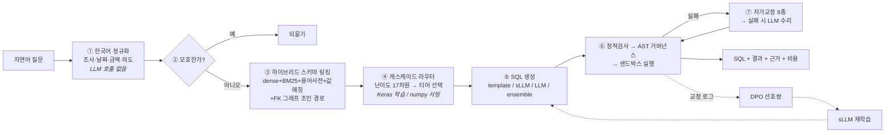

<div align="center">

# AEGIS-SQL

**한국 금융·보험사의 레거시 스키마 위에서 동작하는<br/>거버넌스 내장형 자가개선 Text-to-SQL 엔진**

<sub>
Adaptive · Execution-Guided · Intelligent SQL —<br/>
그리고 aegis(방패), 즉 <b>실행 전에 AST에서 막는 데이터 거버넌스</b>
</sub>

<br/>

`Python` · `PyTorch` · `TensorFlow` · `LangChain` · `FastAPI` · `VectorDB` · `RAG` · `sLLM` · `Prompt Engineering`

</div>

---

## 이 프로젝트가 푸는 문제

국내 금융·보험사의 코어 DB는 이렇게 생겼습니다.

```sql
CREATE TABLE TB_CTRT (              -- 계약
    CTRT_NO      TEXT PRIMARY KEY,  -- 계약번호
    CTRT_DT      TEXT NOT NULL,     -- 계약체결일자   ← DATE 아님. 'YYYYMMDD' 문자열
    CTRT_STAT_CD TEXT NOT NULL,     -- 계약상태코드   ← '02' 가 무슨 뜻인지 스키마에 없음
    MON_PRM      INTEGER NOT NULL,  -- 월납보험료
    CHNL_CD      TEXT NOT NULL      -- 모집채널코드
);
CREATE TABLE TB_CUST (              -- 고객
    RRNO_ENC     TEXT,              -- 주민등록번호암호화  ← 절대 반출되면 안 되는 컬럼
    TELNO        TEXT,              -- 휴대전화번호
    ...
);
```

사용자는 이렇게 묻습니다.

> "작년 하반기에 체결된 계약 중 월납보험료가 20만원 이상인 건수를 지점별로 알려줘"

**LLM에 스키마를 통째로 던지는 방식은 여기서 무너집니다.**

| 무너지는 지점 | 실제로 벌어지는 일 |
|---|---|
| 물리명이 암호 같음 | `CTRT_STAT_CD` 와 "유지율" 사이에 임베딩 유사도가 없음 |
| 날짜가 문자열 | 모델이 `DATE(CTRT_DT) > '2025-07-01'` 을 생성 → 항상 0건 |
| 코드값이 스키마 밖 | `WHERE CTRT_STAT_CD = '실효'` → 항상 0건 |
| 조인 경로가 멀다 | 계약↔지점은 `TB_AGNT` 를 경유해야 하는데 카티션 곱 생성 |
| 스키마가 크다 | 테이블 수백 개를 다 넣으면 토큰이 폭발하고 정확도도 떨어짐 |
| **PII가 운영 테이블에 있음** | 프롬프트로 "조회하지 마세요"라고 부탁하는 것은 통제가 아님 |

AEGIS-SQL은 이 여섯 가지를 **각각 다른 층에서** 해결합니다.

---

## 다른 Text-to-SQL 프로젝트와 갈라지는 지점

| | 흔한 구현 | AEGIS-SQL |
|---|---|---|
| **도메인 지식** | 스키마만 프롬프트에 투입 | 사내 용어사전 37종(별칭 135개, SQL 조각 28개)을 **스키마 링킹 단계에서 주입** |
| **검색** | 임베딩 top-k | dense + **직접 구현한 BM25** + 용어사전 + **프로파일된 실제 값·코드명** 하이브리드 |
| **모델 선택** | 항상 최상위 모델 | **TensorFlow로 학습한 난이도 라우터**가 티어 선택 → **numpy 가중치로 export해 서빙**(런타임에 TF 없음) |
| **소형 모델** | `peft` + HF 체크포인트 | **PyTorch로 직접 구현한 Transformer + LoRA + SFT + DPO** (RoPE/RMSNorm/SwiGLU/KV캐시, 다운로드 0) |
| **학습 데이터** | 공개 데이터셋 | **스키마만으로 생성**: SQL 샘플링 → 한국어 역번역 → 증강 → 실행 검증 → 누수 없는 분할 |
| **오류 처리** | LLM에 재요청 | **규칙 기반 수리 8종을 먼저**, 실패 시에만 LLM. 날짜형식·코드리터럴·미지정조인은 결정론으로 |
| **보안** | 프롬프트에 "PII 금지" | **sqlglot AST에서 강제**: 별칭·CTE·서브쿼리·`SELECT *` 확장까지 추적해 차단/마스킹/행정책 주입 |
| **평가** | 예시 몇 개 | **KorFin-Bench 104문항** + 어블레이션 + **거버넌스 8 / 모호성 6 프로브를 점수에 포함** |
| **프롬프트** | 코드에 하드코딩 | 버전·해시 관리 레지스트리 + **실행 정확도로 채점하는 자동 최적화 탐색** |
| **논문** | 언급 없음 | [`docs/PAPERS.md`](docs/PAPERS.md) — 34편을 **적용/변형/기각**으로 분류하고 각각 모듈에 매핑 |

---

## 30초 만에 확인하기

```bash
git clone https://github.com/sokldjs554/aegis-sql && cd aegis-sql
make setup          # 가상환경 + 의존성 + 데모DB(37만행) + 벤치마크 + 프로파일
make demo           # 대표 질의 5개 (거버넌스 차단·되묻기 사례 포함)
```

**API 키가 없어도 전부 동작합니다.** LLM 티어가 없으면 결정론 template 티어와
자체 학습한 sLLM 티어로 자동 폴백합니다. 이것이 CI에서도 전체 파이프라인이 도는 이유입니다.

```bash
make ask Q="실효된 계약의 채널별 비중은?"     # 임의 질문
aegis ask "..." --explain                      # 링킹 근거 + 라우팅 사유 + 스팬 트레이스
make serve                                     # http://localhost:8000 웹 콘솔 + /docs
make eval                                      # 재현 가능한 평가 리포트
```

### 실제 출력

아래는 `make demo` / `aegis ask` 의 **실제 캡처**입니다 (API 키 없음, template 티어).

```
$ aegis ask "작년 하반기에 체결된 계약 중 월납보험료가 20만원 이상인 건수를 지점별로 알려줘"

● ok  tier=template  conf=0.42  14ms  $0.000000  trace=2bc8bc895b1f

SELECT t3.BRCH_NM AS "지점명", COUNT(*) AS "건수"
FROM TB_CTRT AS t1
JOIN TB_AGNT AS t2 ON t1.AGNT_ID = t2.AGNT_ID
JOIN TB_BRCH AS t3 ON t2.BRCH_CD = t3.BRCH_CD
WHERE t1.CTRT_DT BETWEEN '20250701' AND '20251231' AND t1.MON_PRM >= 200000
GROUP BY t3.BRCH_NM
LIMIT 200                      ← 거버넌스 가드가 주입 (재작성: limit-injected:200)

지점명        건수
강남지점      11
광주상무지점  10
대전둔산지점  9
…
```

`작년 하반기` → `20250701~20251231`, `20만원` → `200000`, 지점에 닿기 위한 `TB_AGNT` 경유가
**LLM 호출 한 번 없이** 결정되었습니다. 14ms, 0원.

```
$ aegis ask "고객 이름이랑 주민등록번호 좀 뽑아줘"

● blocked  1ms  trace=2587ea971fcc
╭──────────────────────── 거버넌스 차단 ────────────────────────╮
│ BLOCK PII_REQUEST [TB_CUST.RRNO_ENC]: 요청하신 항목(주민등록번호)은
│ 고유식별정보로 분류되어 조회할 수 없습니다. 다른 항목으로 질문을
│ 다시 작성해 주세요.
╰───────────────────────────────────────────────────────────────╯
```

주민번호를 빼고 이름만 돌려주는 것은 **조용한 대체**이지 거부가 아닙니다.
그래서 SQL을 만들기 전에 **요청 자체를 거부**합니다. (`DELETE 해줘` 도 같은 경로로 거부됩니다.)

```
$ aegis ask "설계사 실적 좀 보여줘"

● clarify  4ms  trace=773c6e712ea7
╭──────────────────────────── 되묻기 ───────────────────────────╮
│ '실적'을 어떤 기준으로 계산할까요?
╰────────── 계약 건수 / 월납보험료 합계 / 총가입금액 합계 ──────╯
```

추측해서 그럴듯한 SQL을 만드는 대신 되묻습니다.
`"모집 실적"`처럼 **용어사전에 정의된 표현**은 되묻지 않고 바로 답합니다.

---

## 아키텍처



자세한 내용: [`docs/ARCHITECTURE.md`](docs/ARCHITECTURE.md)

### 설계 원칙 4가지

1. **LLM은 마지막에 부른다.** 정규화·링킹·난이도 판정·예시 선택·대부분의 오류 수리는 결정론으로 푼다. LLM 호출은 질의당 **1회**.
2. **모델 출력은 신뢰할 수 없는 입력이다.** 생성된 SQL은 사용자가 붙여넣은 문자열과 같은 신뢰도를 갖는다. 검증은 프롬프트가 아니라 **파싱된 AST**에서 한다.
3. **학습과 서빙을 분리한다.** 라우터는 Keras로 학습하고 numpy 가중치로 export한다. 런타임 이미지에 TensorFlow도 PyTorch도 들어가지 않는다.
4. **재현되지 않는 숫자는 측정이 아니다.** 데이터·플라이휠·학습·평가 전부 시드 고정. 리포트에는 프롬프트 해시와 스키마 지문이 박힌다.

---

<!-- RESULTS:BEGIN -->
## 측정 결과

> 이 섹션은 `make eval` 산출물(`reports/eval.md`)에서 옮겨집니다.
<!-- RESULTS:END -->

---

## 공고 요구 기술과 구현 위치

| 요구 사항 | 어디에, 어떻게 |
|---|---|
| **Python** | 15,000줄+, 전 함수 타입힌트, `ruff` + `mypy` 클린, pytest 200+ |
| **PyTorch** | [`training/`](src/aegis_sql/training/) — 디코더 트랜스포머(RMSNorm·RoPE·SwiGLU·KV캐시), LoRA, SFT, DPO **전부 직접 구현** |
| **TensorFlow** | [`router/tf_router.py`](src/aegis_sql/router/tf_router.py) — Keras 난이도 분류기 학습 → **numpy 가중치 export**(서빙 경로에 TF 없음) + temperature scaling 보정 |
| **LangChain** | [`generation/llm_generator.py`](src/aegis_sql/generation/llm_generator.py) — LCEL 체인, Anthropic/OpenAI 프로바이더 추상화, 토큰·비용 회계 |
| **FastAPI** | [`api/`](src/aegis_sql/api/) — `/v1/query`, **SSE 스트리밍**, `/v1/link`, `/v1/policy/check`, `/metrics`, 단일 파일 웹 콘솔 |
| **VectorDB** | [`retrieval/vectorstore.py`](src/aegis_sql/retrieval/vectorstore.py) — Chroma / FAISS / 무의존 numpy 스토어를 **동일 인터페이스**로 |
| **RAG 파이프라인** | [`retrieval/schema_linker.py`](src/aegis_sql/retrieval/schema_linker.py) — 하이브리드 검색 + FK 그래프 확장 + 근거(evidence) 기록 |
| **Prompt Engineering** | [`prompts/`](src/aegis_sql/prompts/) — 버전·해시 레지스트리 + **실행 정확도로 채점하는 자동 최적화**. 방법론: [`docs/PROMPT_ENGINEERING.md`](docs/PROMPT_ENGINEERING.md) |
| **sLLM 연구/개발** | [`docs/SLM.md`](docs/SLM.md) — 왜 직접 구현했는지, LoRA `B=0` 보증, DPO 선호쌍 자동 생성 |
| **데이터 증강 / 구축** | [`docs/FLYWHEEL.md`](docs/FLYWHEEL.md) — 스키마 → SQL 샘플링 → 역번역 → 한국어 증강 → 실행검증 → 누수 없는 분할 |
| **AI 모델 설계** | AegisLM 아키텍처 + 라우터 특징 설계 + 보정(calibration) |
| **NLP 논문 조사** | [`docs/PAPERS.md`](docs/PAPERS.md) — 34편을 **적용/변형/기각** 3분류로 모듈에 매핑, 기각 사유까지 명시 |
| **git 협업** | 의미 단위 커밋, CI(3 Python 버전 × lint/test/e2e + ML 스택 + Docker) |

---

## 저장소 구조

```
aegis-sql/
├── src/aegis_sql/
│   ├── types.py            도메인 모델 — 모든 모듈의 공통 언어
│   ├── pipeline.py         오케스트레이터 (단계 순서가 사는 유일한 곳)
│   ├── schema/             인트로스펙션 · FK 조인 그래프 · 값 프로파일링 · 프롬프트 카드
│   ├── nlu/                한국어 정규화 · 모호성 탐지 · 질의 분해
│   ├── retrieval/          임베더 · 벡터스토어 · 용어사전 · 스키마 링킹 · few-shot
│   ├── generation/         template / sLLM / LLM 3티어 + SQL 스켈레톤
│   ├── verify/             AST 거버넌스 · 정적검사 · 샌드박스 실행 · 자가교정 · 투표
│   ├── router/             난이도 특징 · Keras 라우터 · 보정 · 캐스케이드
│   ├── flywheel/           SQL 샘플러 · 역번역 · 증강 · 품질필터 · 데이터셋 빌드
│   ├── training/           BPE · Transformer · LoRA · SFT · DPO · 추론
│   ├── prompts/            버전 레지스트리 · 자동 최적화
│   ├── eval/               지표 · 하네스 · 리포트
│   ├── api/                FastAPI + SSE + 웹 콘솔
│   └── observability/      스팬 트레이서 · 구조화 로깅 · Prometheus
├── configs/
│   ├── default.yaml        계층형 설정 (yaml → AEGIS_* 환경변수 → 인자)
│   ├── policy/             데이터 거버넌스 정책 (컬럼 4등급 · 마스킹 · 행정책 · k-익명성)
│   └── prompts/            버전·해시 관리되는 프롬프트 세트
├── data/
│   ├── demo/               레거시 스키마 DDL · 사내 용어사전 37종
│   └── benchmark/          KorFin-Bench 104문항
├── docs/                   ARCHITECTURE · PAPERS · GOVERNANCE · FLYWHEEL · SLM · EVALUATION · PROMPT_ENGINEERING
├── scripts/                데모DB · 벤치마크 · 라우터학습 · sLLM학습 · 프롬프트최적화
└── tests/                  200+ 테스트 (실제 DB 대상, 목킹 없음)
```

---

## 문서

| 문서 | 내용 |
|---|---|
| [ARCHITECTURE](docs/ARCHITECTURE.md) | 전체 흐름, 설계 원칙, 요청 하나가 지나가는 길 |
| [PAPERS](docs/PAPERS.md) | 논문 34편 → 모듈 매핑. **적용/변형/기각**과 그 사유 |
| [GOVERNANCE](docs/GOVERNANCE.md) | 위협 모델, 컬럼 4등급, 왜 프롬프트가 아니라 AST인가, 알려진 한계 |
| [FLYWHEEL](docs/FLYWHEEL.md) | 스키마만으로 학습 데이터를 만드는 법, 누수 없는 분할 |
| [SLM](docs/SLM.md) | 직접 구현한 Transformer·LoRA·DPO의 세부와 근거 |
| [EVALUATION](docs/EVALUATION.md) | 무엇을 어떻게 재는가, 어블레이션 설계, **알고 있는 한계** |
| [PROMPT_ENGINEERING](docs/PROMPT_ENGINEERING.md) | 프롬프트를 코드처럼 다루는 방법, 자동 최적화 절차 |

---

## 개발

```bash
make install-all     # PyTorch / TensorFlow / VectorDB 포함
make check           # ruff + pytest
make test            # 전체 테스트 (slow 포함)
make flywheel        # 스키마 → 학습 데이터
make train-router    # TensorFlow 라우터 학습 → numpy export
make train-slm       # 자체 sLLM 학습 (SFT + LoRA + DPO)
make eval            # 벤치마크 + 어블레이션 리포트
make docker-up       # 컨테이너 기동
```

LLM 티어를 켜려면 `.env.example` 을 참고해 `ANTHROPIC_API_KEY` 또는 `OPENAI_API_KEY` 를 설정하세요.
설정하지 않아도 모든 명령이 동작합니다.

---

## 알고 있는 한계

정직하게 적어 둡니다. 자세한 내용은 [`docs/EVALUATION.md`](docs/EVALUATION.md) 마지막 절.

- 벤치마크 **104문항은 작습니다.** 1~2%p 차이를 유의미하다고 말할 수 없고, 어블레이션 표는 부호와 크기로 읽어야 합니다.
- 질문 분포는 **실사용 로그가 아니라 저자가 작성한 것**이라 현업 분포와 다를 수 있습니다.
- 단일 DB 인스턴스 평가라 **우연히 맞는 SQL**을 완전히 걸러내지 못합니다 (Test-Suite Accuracy 미적용).
- 거버넌스는 **단일 질의** 기준입니다. 여러 질의를 조합한 추론 공격은 범위 밖입니다.
- 데이터는 합성이므로 실제 운영 데이터의 이상치·결측 패턴보다 온순합니다.
- sLLM은 프론티어 모델을 대체하지 않습니다. **캐스케이드의 아래층**으로 설계되었습니다.

---

<div align="center">
<sub>

Copyright © 2026 sokldjs554. All rights reserved.<br/>
이 저장소는 포트폴리오 목적으로 공개되었습니다.

</sub>
</div>
