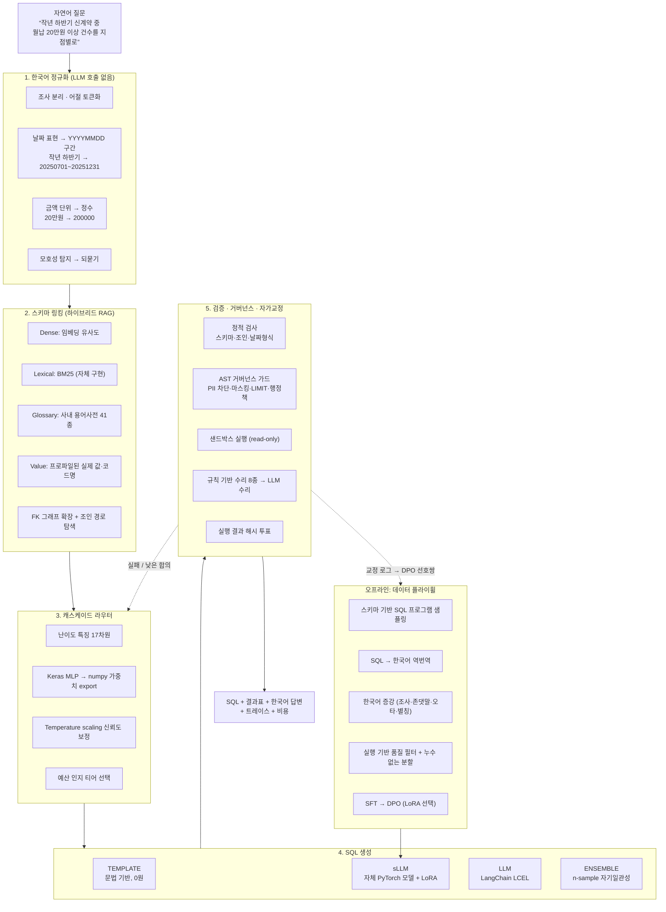

# 아키텍처

## 한 장 요약



## 왜 이렇게 나눴는가

### 원칙 1 — LLM은 마지막에 부른다
질문 정규화, 스키마 링킹, 난이도 판정, 예시 선택, 대부분의 오류 수리는 **결정론적으로 풀 수 있다**.
LLM 호출은 비싸고(수백 ms~수 초, 토큰당 과금) 재현이 어렵다.
그래서 파이프라인의 1·2·3단계와 5단계의 앞부분에는 LLM 호출이 **한 번도 없다**.
LLM은 "정말 필요한 질문"에 대해 **한 번** 호출된다.

### 원칙 2 — 모델 출력은 신뢰할 수 없는 입력이다
생성된 SQL은 사용자가 붙여넣은 문자열과 동일한 신뢰도를 갖는다.
따라서 실행 전에 **파싱된 AST 위에서** 검증한다(`verify/ast_guard.py`).
프롬프트에 "주민등록번호는 조회하지 마세요"라고 쓰는 것과, 파서가 해당 컬럼 참조를 찾아
차단하는 것은 보증 수준이 다르다. 전자는 확률, 후자는 불변식이다.

### 원칙 3 — 학습과 서빙을 분리한다
- 라우터: **Keras로 학습 → numpy 가중치로 export → 서빙은 numpy만** (`router/tf_router.py`)
- sLLM: PyTorch 체크포인트, 서빙 시에만 lazy 로드
- 결과적으로 런타임 Docker 이미지에 TensorFlow도 PyTorch도 들어가지 않는다.
  (`pip install -e ".[llm]"` 과 `".[all]"` 의 설치 용량 차이는 수 GB 규모다.)

### 원칙 4 — 재현 가능해야 측정이다
데모 DB, 플라이휠, 학습, 평가 전부 시드가 고정되어 있고, 평가 리포트에는
**사용된 프롬프트의 해시**, 스키마 지문, 티어, 비용이 함께 기록된다.

---

## 모듈 지도

```
src/aegis_sql/
├── types.py               도메인 모델 — 모든 모듈이 이 타입으로 대화한다
├── config.py              계층형 설정 (yaml → AEGIS_* 환경변수 → 인자)
├── pipeline.py            오케스트레이터 (아래 단계들을 엮는 유일한 지점)
│
├── schema/                스키마 이해
│   ├── introspect.py      DDL 주석에서 한글 데이터사전 복원 + 공통코드 그룹 추론
│   ├── graph.py           FK 조인 그래프, 최단 조인 경로, Steiner 근사, 코드 조인
│   ├── profile.py         컬럼 값 프로파일링 (값 링킹의 재료)
│   └── card.py            프롬프트용 스키마 직렬화 4종 (mschema/ddl/compact/slm)
│
├── nlu/                   한국어 이해 (LLM 없음)
│   ├── korean.py          조사·숫자단위·날짜표현·큐 탐지
│   ├── ambiguity.py       모호성 점수 + 되묻는 질문 생성
│   └── decompose.py       난이도 분류 + 서브질문 분해
│
├── retrieval/             하이브리드 RAG
│   ├── embedder.py        HashingEmbedder(무의존) / SentenceTransformer(선택)
│   ├── vectorstore.py     Numpy / Chroma / FAISS — 동일 인터페이스
│   ├── glossary.py        사내 용어사전
│   ├── schema_linker.py   dense + BM25 + glossary + value + FK확장
│   └── fewshot.py         마스킹 유사도 + MMR 다양성
│
├── generation/            SQL 생성 3티어
│   ├── base.py            Generator 프로토콜
│   ├── skeleton.py        정규화·스켈레톤·난이도 (평가/중복제거 공통 축)
│   ├── template_generator.py  문법 기반 결정론 생성기 (API 키 0원 경로)
│   ├── slm_generator.py   자체 PyTorch 모델 추론
│   └── llm_generator.py   LangChain LCEL 체인
│
├── llm/                   프로바이더 추상화 + 가격표
├── prompts/               버전·해시 관리되는 프롬프트 레지스트리 + 자동 최적화
│
├── verify/                검증·거버넌스·교정
│   ├── ast_guard.py       PII/DML/LIMIT/행정책/k-익명성 — AST 레벨 강제
│   ├── static_check.py    실행 없이 잡는 오류 (날짜형식·미지정조인·GROUP BY)
│   ├── executor.py        read-only 샌드박스 + 타임아웃 + 행 제한
│   ├── repair.py          규칙 기반 수리 8종 → LLM 수리
│   └── selfconsistency.py 실행 결과 해시 투표
│
├── router/                캐스케이드
│   ├── features.py        난이도 특징 17차원
│   ├── tf_router.py       Keras 학습 → numpy 서빙
│   ├── calibrator.py      temperature scaling, ECE
│   └── cascade.py         티어 선택 + 예산 + 사후 에스컬레이션
│
├── flywheel/              데이터 자가생성
├── training/              PyTorch sLLM (tokenizer/model/lora/sft/dpo/infer)
├── eval/                  지표·하네스·리포트
├── api/                   FastAPI (SSE 스트리밍, 웹 콘솔, 메트릭)
└── observability/         트레이스·구조화 로깅·Prometheus
```

## 요청 하나가 지나가는 길

```
POST /v1/query {"question": "..."}
  │
  ├─ span: normalize        (~1ms)   KoreanNormalizer
  ├─ span: ambiguity        (~1ms)   모호하면 여기서 status=clarify 로 종료
  ├─ span: link             (~15ms)  하이브리드 스키마 링킹 (전체 스키마 2,554토큰 → 400~850토큰)
  ├─ span: fewshot          (~5ms)   마스킹 유사도 + MMR
  ├─ span: route            (~0.3ms) numpy 라우터 → tier + confidence
  ├─ span: generate         (티어에 따라 3ms ~ 수 초)
  ├─ span: static_check     (~2ms)   실행 전에 잡히는 오류
  ├─ span: guard            (~3ms)   PII 차단 / 마스킹 / LIMIT / 행정책
  ├─ span: execute          (~5~50ms)
  ├─ span: repair           (실행 실패 시 — 그리고 **성공했더라도 정적 검사가
  │                          "확실히 틀린 비교"를 잡았을 때**) 규칙 8종 → 재실행
  │                          → 그래도 실패면 LLM 수리. 교정본은 가드를 다시 통과해야 한다
  ├─ span: vote             (앙상블 시) 실행 결과 해시 다수결
  └─ span: answer           한국어 요약 (LLM 있을 때만)
  │
  └─ AnswerBundle{ sql, executed_sql, rows, tier, confidence, cost_usd, trace }
```

트레이스는 응답 본문(`?explain=true`)과 CLI(`aegis ask --explain`), 웹 콘솔에서 그대로 볼 수 있다.
"왜 이 컬럼을 골랐는가"는 `linked.evidence`에 점수와 출처(dense/lexical/glossary/value)로 남는다.
