# 데이터 플라이휠

> **문제:** 한국어 × 보험 도메인 × 레거시 스키마에 대한 Text-to-SQL 학습 데이터는 존재하지 않는다.
> 사람이 만들면 1,000쌍에 수 주가 걸리고, LLM에게 "질문 만들어줘"라고 시키면
> 스키마에 없는 컬럼을 지어낸 데이터가 섞인다.
>
> **해법:** 방향을 뒤집는다. **정답(SQL)을 먼저 만들고 질문을 역생성**한다.
> SQL이 스키마 문법에서 나오므로 환각이 구조적으로 불가능하고,
> 실행해 보면 정답 여부를 기계가 판정할 수 있다.

## 파이프라인

```mermaid
flowchart LR
    S["스키마 + 프로파일<br/>+ 용어사전"] --> A
    A["① SQL 프로그램 샘플러<br/>문법 기반, 난이도 3단계<br/>18+ 템플릿"] --> B
    B["② 역번역<br/>SQL → 자연스러운 한국어<br/>(한글 논리명·업무용어 사용)"] --> C
    C["③ 한국어 증강<br/>조사/존댓말/어순/오타/별칭<br/>숫자·날짜·코드값 불변 보장"] --> D
    D["④ 품질 필터<br/>실행·비어있음·퇴화·중복"] --> E
    E["⑤ 누수 없는 분할<br/>스켈레톤 클러스터 단위"] --> F
    F["train / dev / test.jsonl<br/>+ manifest.json"] --> G
    G["⑥ SFT → LoRA → DPO<br/>(PyTorch, CPU)"] --> H["sLLM 체크포인트"]
    H -.-> I["운영 중 자가교정 로그"]
    I -.-> J["DPO 선호쌍<br/>chosen=gold, rejected=실패 SQL"]
    J --> G
```



## ① SQL 프로그램 샘플러 — 왜 문법인가

LLM에게 SQL을 만들라고 하면 존재하지 않는 컬럼을 쓴다.
샘플러는 **스키마 그래프와 프로파일에서만** 슬롯을 채우므로 그럴 수 없다.

- 테이블/컬럼: `SchemaGraph`에서만 선택
- 조인: `JoinGraph.connect()`가 계산한 실제 FK 경로만 사용
- 코드값: `profile.code_labels`의 실존 코드만
- 날짜 구간: 해당 컬럼의 관측 `min~max` 안에서만
- 임계값: 관측 분위수 근처에서만 (그래야 결과가 비지 않는다)

난이도 3단계 × 18종 이상의 템플릿:
`easy`(단일 테이블 집계·필터·top-N) / `medium`(2~3 테이블 조인 + 그룹핑 + 코드 조인 + HAVING + 비율) /
`hard`(상관 서브쿼리, 2단 CTE, 기간 대비, anti-join, 중첩 집계).

## ② 역번역 — 물리명을 지운다

```sql
SELECT cd.CD_NM, COUNT(*) FROM TB_CTRT t
JOIN TB_COMM_CD cd ON cd.CD_GRP='CHNL' AND cd.CD=t.CHNL_CD
WHERE t.CTRT_DT BETWEEN '20250701' AND '20251231'
GROUP BY cd.CD_NM ORDER BY 2 DESC
```
↓
> "작년 하반기에 체결된 계약을 모집 채널별로 많은 순서대로 알려줘"

`TB_CTRT`가 아니라 "계약", `CHNL_CD`가 아니라 "모집 채널", `'20250701'~'20251231'`이 아니라
"작년 하반기"로 표현한다. 이렇게 해야 **실사용자의 질문 분포**에 가까워진다.
API 키가 있으면 `backtranslate.user` 프롬프트로 한 번 더 다듬지만, **없어도 전체가 동작한다.**

## ③ 한국어 증강 — 영어식 EDA는 한국어에서 잘 듣지 않는다

| 변형 | 예시 |
|---|---|
| 용어사전 별칭 치환 | 유지율 → 계약유지율 → 보유율 |
| 조사 변형/생략 | "계약이 몇 건" → "계약 몇 건" → "계약은 몇 건" |
| 존댓말/반말/명령형 | 알려줘 / 알려주세요 / 조회해줘 / 뽑아줘 / …는? |
| 어순 교체 | "작년 하반기 지점별 계약" → "지점별로 작년 하반기 계약" |
| 띄어쓰기 오류 | "월납보험료" ↔ "월납 보험료" |
| 자모 단위 오타 | "계약" → "계얃" (종성 교란, 0xAC00 산술로 합성/분해) |
| 군더더기 | "혹시", "좀", "한번" 삽입 |

**불변 조건:** 숫자·날짜·코드값은 증강 전후로 반드시 동일해야 한다.
증강기는 변환 전후에서 이 토큰들을 추출해 비교하고, 달라지면 그 변형을 폐기한다.
(이 검증이 없으면 "20만원"이 "30만원"이 된 학습쌍이 조용히 섞인다.)

## ④ 품질 필터 — 합성 데이터의 진짜 리스크

| 단계 | 걸러내는 것 |
|---|---|
| 실행 검증 | 문법/스키마 오류 |
| 빈 결과 | 조건이 과하게 좁아 답이 없는 쌍 |
| 퇴화 결과 | 단일 NULL, 항상 0인 COUNT, 상수 결과 |
| 중복 제거 | (SQL 스켈레톤, 마스킹 질문) 3-gram Jaccard 유사도 |
| 난이도 균형 | 설정된 mix(easy .3 / medium .45 / hard .25)로 리샘플 |

## ⑤ 누수 없는 분할 — 대부분의 합성 파이프라인이 틀리는 지점

무작위 분할을 하면 **같은 SQL 스켈레톤의 증강 변형**이 train과 test에 동시에 들어간다.
모델은 그 패턴을 외우고, 평가 점수는 부풀려진다.

그래서 `quality_filter.py`는 **SQL 스켈레톤을 클러스터 키로 삼아 클러스터 전체를 한 split에 배정**한다
(80/10/10). 결과적으로 test의 스켈레톤은 train에 한 번도 등장하지 않는다.
`manifest.json`에 스켈레톤 중복 0건이 기록되고, 스모크 테스트가 이를 assert 한다.

## ⑥ 학습으로 이어지는 고리

- **SFT**: 프롬프트 구간은 `-100`으로 마스킹해 **SQL 토큰에만** 손실을 준다.
- **LoRA**: `q_proj / v_proj / o_proj`에 rank 16 어댑터. 학습 파라미터 3% 미만.
- **DPO**: 선호쌍을 **엔진이 운영 중에 스스로 만든다**.
  `chosen` = 검증을 통과한 gold SQL, `rejected` = 자가교정 로그에 남은 실패 SQL.
  사람 라벨링 0건으로 "실패했던 패턴을 덜 만들도록" 정렬된다. 이것이 플라이휠이 도는 부분이다.

## 재현

```bash
make flywheel                       # 스키마 → 학습셋 (기본 4,000 프로그램)
cat data/generated/flywheel/manifest.json
make train-slm                      # SFT (+LoRA, +DPO)
```

`manifest.json`에는 split별 건수, 난이도 분포, 템플릿별 건수, 각 필터 단계의 탈락 수,
시드, 스키마 지문, 소요 시간이 기록된다. 시드가 같으면 결과도 같다.
